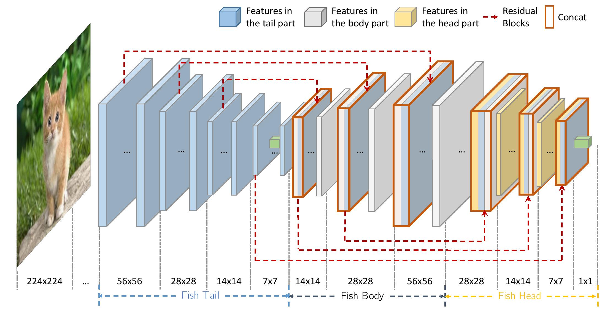

# FishNet



This repo holds the implementation code of the paper:

[FishNet: A Versatile Backbone for Image, Region, and Pixel Level Prediction](http://papers.nips.cc/paper/7356-fishnet-a-versatile-backbone-for-image-region-and-pixel-level-prediction.pdf)
, Shuyang Sun, Jiangmiao Pang, Jianping Shi, Shuai Yi, Wanli Ouyang, NeurIPS 2018.

FishNet was used as a key component
 for winning the 1st place in [COCO Detection Challenge 2018](http://cocodataset.org/#detection-leaderboard).
 
 Note that the results released here are a bit better than what we have reported in the paper.

### Prerequisites
- Python 3.6.x
- PyTorch 0.4.0+

### Data Augmentation

| Method | Settings |
| -----  | -------- |
| Random Flip | True |
| Random Crop | 8% ~ 100% |
| Aspect Ratio| 3/4 ~ 4/3 |
| Random PCA Lighting | 0.1 |

**Note**: We apply weight decay to all weights and biases instead of just the weights of the convolution layers.

### Training
To train FishNet-150 with 8 GPUs and batch size 256, simply run
```
python main.py --config "cfgs/fishnet150.yaml" IMAGENET_ROOT_PATH
```

### Models
**Models trained without tricks**

|    Model   | Params | FLOPs | Top-1  | Top-5  | Baidu Yun | Google Cloud |
| ---------- | ------ | ----- | ------ | -----  | --------- | ------------ |
| FishNet99  | 16.62M | 4.31G | 77.41% | 93.59% | [Download](https://pan.baidu.com/s/11U3sRod1VfbDBRbmXph6KA)| [Download](https://www.dropbox.com/s/hvojbdsad5ue7yb/fishnet99_ckpt.tar?dl=0) |
| FishNet150 | 24.96M | 6.45G | 78.14% | 93.95% | [Download](https://pan.baidu.com/s/1uOEFsBHIdqpDLrbfCZJGUg)| [Download](https://www.dropbox.com/s/hjadcef18ln3o2v/fishnet150_ckpt.tar?dl=0)
| FishNet201 | 44.58M | 10.58G| 78.76% | 94.39% | Available Soon | Available Soon |

**Models trained with cosine lr schedule (200 epochs) and label smoothing**

|    Model   | Params | FLOPs | Top-1  | Top-5  | Baidu Yun | Google Cloud |
| ---------- | ------ | ----- | ------ | -----  | --------- | ------------ |
| FishNet150 | 24.96M | 6.45G | 79.35% | 94.75% | [Download](https://pan.baidu.com/s/1pt31cp-xGcsRJKZAPcp4yQ) | [Download](https://www.dropbox.com/s/ajy9p6f97y45f1r/fishnet150_ckpt_welltrained.tar?dl=0) |
| FishNet201 | 44.58M | 10.58G| 79.71% | 94.79% | [Download]() | [Download](https://www.dropbox.com/s/kvz2dmxe3fzn10m/fishnet201_ckpt_welltrain.tar?dl=0) |

To load these models, e.g. FishNet150, you need to first construct your FishNet150 structure like:

```
from models.network_factory import fishnet150
model = fishnet150()
```

and then you can load the weights from the pre-trained checkpoint by:
```
checkpoint = torch.load(model_path)  #  model_path: your checkpoint path, e.g. checkpoints/fishnet150.tar
best_prec1 = checkpoint['best_prec1']
model.load_state_dict(checkpoint['state_dict'])
optimizer.load_state_dict(checkpoint['optimizer'])
```

Note that you do **NOT** need to decompress the model using the ```tar``` command.
The model you download from the cloud could be loaded directly.

### TODO:
- [x] Update our arxiv paper.
- [x] Release pre-train models.
- [ ] Train the model with more training tricks.

### Citation

If you find our research useful, please cite the paper:
```
@inproceedings{sun2018fishnet,
  title={FishNet: A Versatile Backbone for Image, Region, and Pixel Level Prediction},
  author={Sun, Shuyang and Pang, Jiangmiao and Shi, Jianping and Yi, Shuai and Ouyang, Wanli},
  booktitle={Advances in Neural Information Processing Systems},
  pages={760--770},
  year={2018}
}
```

### Contact
You can contact Shuyang Sun by sending email to kevin.sysun@gmail.com
